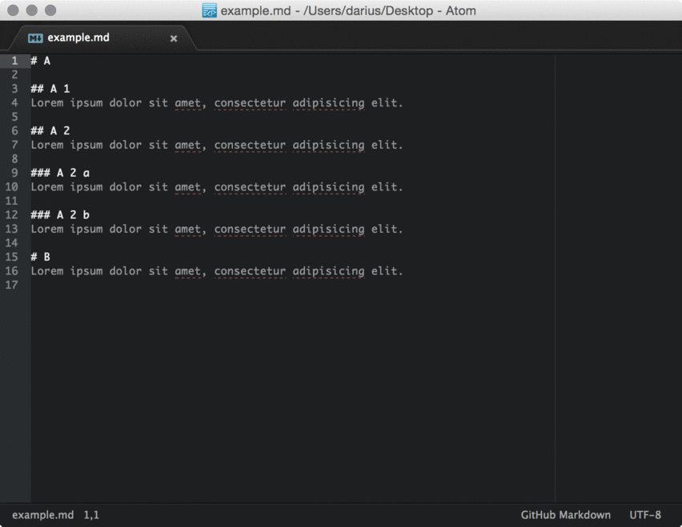

# Markdown TOC

Generate TOC (*table of contents*) of headlines from parsed [markdown](http://en.wikipedia.org/wiki/Markdown) file.



## Installation

```bash
apm install markdown-toc
```


## Features

- Depth control [1-6]
- Auto linking via  anchor tags, e.g.  `# A 1` → `#a-1`
- Enable or disable links
- Update on save


## Questions?

Don't be shy and feel free to contact me via [Twitter](http://twitter.voidplus.de).


## License

The package is Open Source Software released under the [License](LICENSE.md). It's developed by [Darius Morawiec](http://voidplus.de).